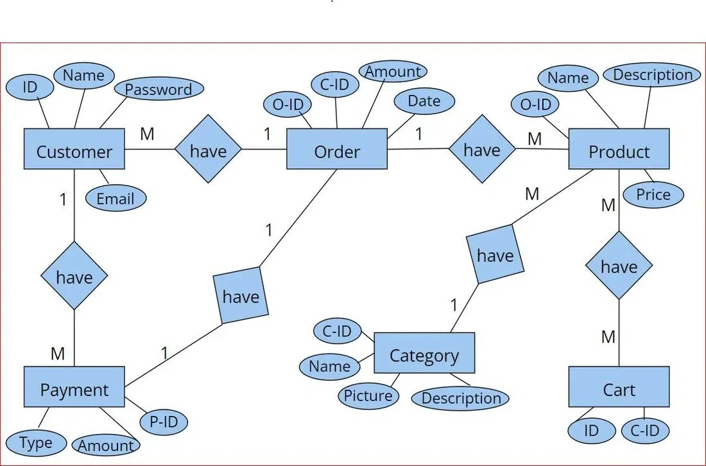
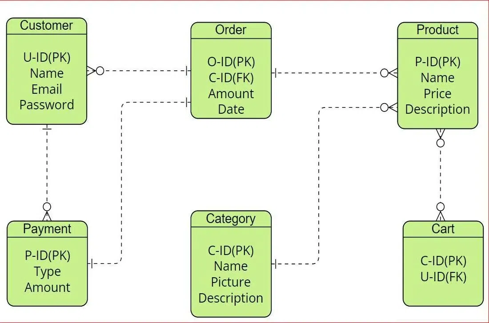

# Designing a database for a specific business case of Shopee

The database should have some characteristics:

- Simple and Functional Database Structure

- High Performance: efficient enough to store, fetch, and change information about products, customers, orders, and so on.

- High Availability and Scalability

- Security and Privacy

Based on the above characteristics, an e-commerce database design boils down into three major aspects as the following:

1. The Scope of the Database.

   - Core-functions: the functions that are necessary for facilitating the day-to-day operations of the e-commerce platform.

     - User Management/Authentication

       - Allow users to register and create accounts.
       - Provide features for user login, logout, and password management.
       - Store user information such as name, email, and password securely.

     - Product/Inventory Management

       - Display a catalog of products with details such as name, price, description, and images.
       - Allow users to browse products by category.
       - Implement search and filtering functionality for easy product discovery.

     - Shopping Cart Function

       - Allow users to add products to their shopping cart.
       - Provide features for updating quantities and removing items from the cart.
       - Calculate and display the total price of items in the cart.

     - Payment Management
       - Support multiple payment methods such as credit card, debit card, UPI, etc.
       - Securely handle payment transactions using encryption and tokenization techniques.
       - Store payment details including payment ID, type, and amount.

     - Shipping/Logistics Management

     - Category Management:
       - Allow administrators to create, update, and delete product categories.
       - Associate products with appropriate categories to facilitate navigation.
       - Display category images and descriptions to enhance user experience.
     - Order Processing:
       - Enable users to place orders securely.
       - Collect order details such as order ID, date, and total amount.
       - Provide order tracking functionality for users to monitor the status of their orders.

   - Extra/Additional functions are the nice-to-have functions for the e-commerce platform that will enhance the user experience for both end-users (customers) and administrators (business).

     - Marketing Functions

     - Help Desk/Support

     - Advanced Analytics
  
     - Third-Party Integrations

2. Type of the Database.

   - RDBMS: providing the required consistency and integrity for the core-functions of the e-commerce platform. It allows easy management of products, orders, customers, categories, payments information as well as cart management.

     - Products are categorized in a user-friendly manner, as well as users can register and create multiple addresses in one account.

     - Orders are placed by customers. Payment methods are diversified which is aimed at enhancing security and flexibility in transactions.

     - The shopping cart management system enables users to add, and check out products thereby helping with a smooth shopping process.

   - NoSQL: providing the required performance and scalability to effectively manage large catalogs and unstructured data like user data and images.

3. Database Infrastructure.

    - One option is to provision a server, install the database software and then manage all the aspects from security to maintenance.

    - The other option is to use a managed database service like Amazon RDS, Azure SQL for RDBMS, Amazon DynamoDB, or Azure CosmosDB for NoSQL.

Example ERD:

References:

- GeeksforGeeks
- DEV Community
- Github
- etc.

Feel free to issue me if there's any problem.
